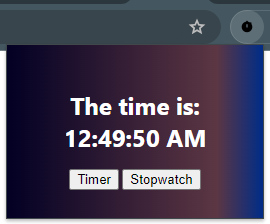
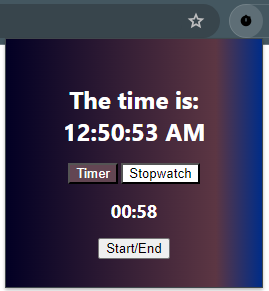
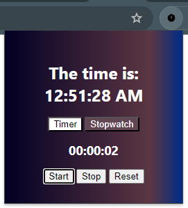

# TimeMaster

Timer for the lazy people.

## Elevator Pitch

Lazy to look for a pomodoro timer?
Lazy to open your stopwatch?
TimeMaster is for you!
With a 20-minute pomodoro timer and an intuitive stopwatch, TimeMaster simplifies timekeeping, ensuring accessibility and ease of use for all users.

## About this project

### What inspired you

As fellow lazy students who wish to time ourselves when practicing for exams, we also want an easy to use product that has both timer and stopwatch. More importantly, something that is easily accessible.

### What you learned

Our journey in building TimeMaster equipped us with valuable insights into developing Google Chrome extensions. Navigating through the available resources and references, we honed our skills to deliver a polished and functional product.

### How you built your project

We leveraged what was provided by Google Chrome and with some references, we were able to build our project.

### Challenges you faced

The integration of Chrome storage posed challenges due to its asynchronous nature. Through perseverance, we successfully addressed some issues and mitigated others.

## Project Gallery

### Main page when the extension is opened

### When Timer is clicked

Similar to typical pomodoro timers, our pomodoro timer is also 20 minutes long.

### When Stopwatch is clicked

